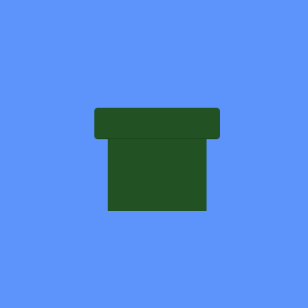
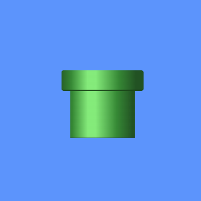
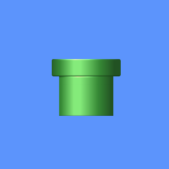
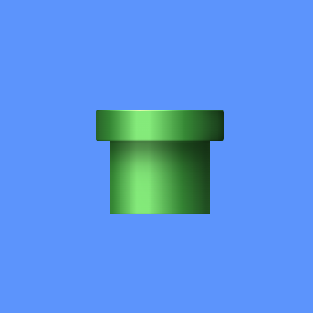
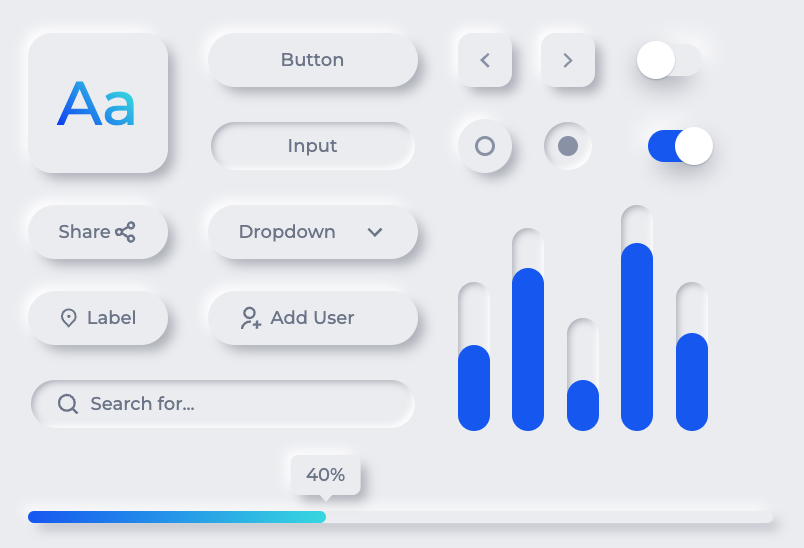

# Why you should care about my doodles

We all know that play is important to the development of children. It helps build social and cognitive skills while allowing children to assert their independence for adults. I'm sure we've all also heard that play can be good for adults as well. Doing puzzles like sudoku can help prevent cognitive decline as we get older and let's not underestimate the importance of fun in our lives. We need that time to let stress go and just focus on something that isn't worrying about finances or whether the planet is going to remain habitable for us.

Beyond all that though, play is, at its heart, practice. Playing house is for practicing social skills. You practice problem-solving when you play Sudoku. I have no idea what my friends and I were practicing when we were kids playing "Find the best rock," but I'm sure it was something useful... As software developers we often play using personal projects. Depending on how you approach those projects and the scope of them they can feel more like work than a hobby. For true play, at least for me, I need something small enough in scope that it won't inevitably get tossed into the unfinished project pile and that I can toss once I'm done still feeling accomplished.

[Katas](https://github.com/uplift-delivery/katas) fit this bill to some extent, but I needed something to stretch those front-end skills. You can mock my millennial need for instant gratification all you like, but I love working in such a visual medium. That's why I started doing little doodles on [CodePen.io](https://codepen.io/). If you look at [my profile](https://codepen.io/caesura) you'll see a few attempts to start daily challenges and my near immediate abandonment of them. I've been popping in to do tiny pens when I have the free time. You'll see very few large projects in there from me and the one or maybe two that you do see are groups of components that I was able to drop and do a piece of here are there. My work there all feels like fun and play; just doodles when I feel like it. So how are these doodles help our clients? I've chosen an example to demonstrate.

When I start a new doodle I do two things. First I decide what I'm going to create. For this one, I decided to make a tunnel that I think many of you will recognize as it builds up. Secondly, I often choose something specific to work on. You may notice this trend in my pens if you're looking. I don't focus on doing them the most efficient way possible. None of these doodles would make it to production anyway. I'd never hand draw a complex image using CSS for a website when SVGs exist. I choose what I want to practice and lean hard on that aspect. For this example I was working on linear gradients and box shadows.

First I begin by creating the basic shape of the tunnel. It's just a couple of dark green divs. Right now it looks like nothing, but I've watched enough Bob Ross to know that blobs of color can easily turn into complex masterpieces. I'm making much, much less than masterpiece, but a similar principle applies.

I'm simplifying this like crazy, but the next step is to add depth to the green blobs. Using a linear gradient, I'm able to give the previously two-dimensional shapes some appearance of having three dimensions by adding a distinct light source. Use lighter colors to mimic a shine where the light hits it and darker colors to define the shadows where light wouldn't be hitting the curves as much. I say I'm simplifying it a lot because the top piece and the bottom have different widths so the positioning took a bit of work and the gradient itself involves 3 different colors, with variants in opacity, and five stops. It's not the most complex gradient, but it also isn't something you can just slap on there without much thought.

The next step is subtler, but still important. An object in real life would have a top dimension, right? The next step defines the top dimension of the lid. If you look closely at the previous image and the next there's now a rim defined with a different gradient as the light source would hit the rim at a different angle than the body. Oddly this small little piece has a more complicated gradient than the reset of the body. Small as it is, it's important to portray a three-dimensional object.

I'm going to oversimplify the next step in the name of brevity once again. The last bit is where I practice my box shadows. On the top of the tunnel the shadows aren't quite deep enough around the curve opposite the light source, so I needed to add some there, and, as it was before, there was no indication that the lid of the tunnel hung over the body of it. It looked like the lid and the tunnel body were equal distance away from the viewer. Adding some shadows to the body, especially focusing on the area opposite the light source, provides that dimension.

That's how I ended that pen. It's not too big of a project, and it's a component I can build off going forward if I ever decide to doodle something of the same theme again. I actually created this pen back in 2016, so looking at it, I think I could make some improvements. I've practiced my gradients and box shadows quite a bit since then, but I try to leave my projects as they are once I've finished. I don't want to get stuck in a loop of updating every little piece of my work every time I notice it's not to my current skill level. It's just for fun and practice after all. If you're curious to see the code you can view it [here](https://codepen.io/caesura/pen/rNoGgLM). If you notice that the created date of the linked pen is not in 2016 like I said, it's because I pulled this out of one of my private pens to be able to publicly expose it without showing off some of my other unfinished work.

Now that you've seen the process you might be wondering what that practice buys me. Web UI doesn't really involve light sources or complex shadows and gradients. Well people often ask me "How do I learn CSS?". This is how. Doing projects outside the norm brings up edge case problems to solve. Learning how to make a box shadow in that shape means I understand the finer points of the box shadow property. Doing complex gradients means simple gradients are easy for me. It means making gradients and shadows for something more practical, as seen below, takes minutes instead an hour. I don't have to spend time for searching how to solve problems because I've already solved harder versions in the same vein. Just like practicing any other discipline.

[CodePen](https://codepen.io/caesura/pen/QWNjvOX)

At a loss for what to make? Use an image as a model. Search [CodePen](https://codepen.io/) for inspiration. There are creators on there with way more skill than I demonstrate. You can get a design from [Dribbble](https://dribbble.com/). The excellent design for the components above came from [Emy Lascan](https://www.sketchappsources.com/free-source/4253-neumorphic-ui-components-sketch-freebie-resource.html). Do what you want. Have fun with it. Play.

